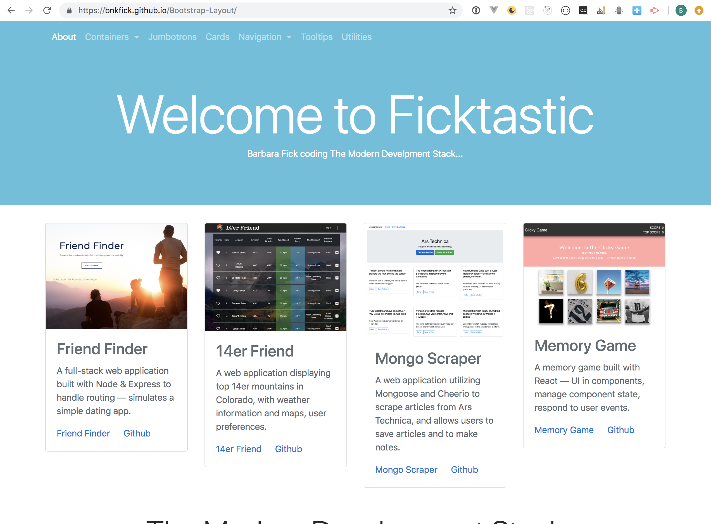

# Bootstrap-Layout
Experimenting with Bootstrap to get considerably more familiar with features such as navbar and utilities.

* Cards
* Jumbotrons
* Containers
* Navbars
* Navs
* Utilities
* Tooltips

## Please check out the launched app on Github 
[here](https://bnkfick.github.io/Bootstrap-Layout/)!

### Screenshot

